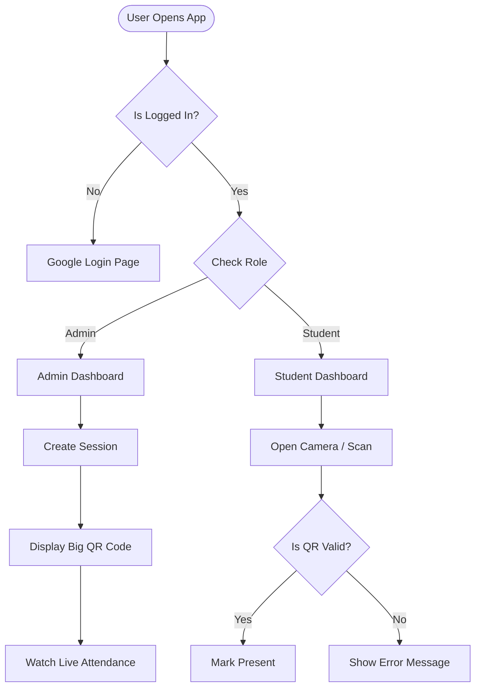

**Phase 2 is the "Design & Architecture" Phase.**


---


```markdown
# 2.0 Design & Architecture
**Status:** In Progress
**Tools:** Figma, Mermaid.js, Firestore

## 2.1 Design System (UI/UX)
**Theme:** "Cyberpunk Professional" (Dark Mode First)
**Rationale:** Dark mode reduces eye strain in low-light classrooms and saves battery on OLED screens.

### Color Palette
| Token | Hex Code | Usage |
| :--- | :--- | :--- |
| `bg-primary` | `#0f172a` | Main background (Slate 900) |
| `bg-card` | `#1e293b` | Cards/Modals (Slate 800) |
| `text-primary` | `#f8fafc` | Headings (Slate 50) |
| `accent-success` | `#10b981` | "Present" Status (Emerald 500) |
| `accent-error` | `#ef4444` | "Absent" Status (Red 500) |

### Typography
* **Headings:** `Inter` (Bold, Tracking-tight) - for clarity.
* **Data/Numbers:** `JetBrains Mono` - for tabular attendance data.

---

## 2.2 Database Schema (Firestore)
*Since Firestore is NoSQL, we define "Collections" and "Documents" instead of Tables.*

### Collection: `users`
*Represents a student or admin.*
```json
{
  "uid": "string (Auth ID)",
  "email": "string",
  "role": " 'admin' | 'student' ",
  "fullName": "string",
  "studentId": "string (Optional)",
  "createdAt": "timestamp"
}

```

### Collection: `sessions`

*Represents a single class meeting (e.g., "Math 101 - Dec 30").*

```json
{
  "sessionId": "string (Auto-ID)",
  "classCode": "string (e.g., 'IT-101')",
  "qrString": "string (The secure code hidden in QR)",
  "isActive": "boolean",
  "startTime": "timestamp",
  "endTime": "timestamp",
  "createdBy": "string (Admin UID)"
}

```

### Collection: `logs`

*The actual attendance record.*

```json
{
  "logId": "string (Auto-ID)",
  "sessionId": "string (Ref to sessions)",
  "studentId": "string (Ref to users)",
  "timestamp": "timestamp",
  "status": " 'present' | 'late' ",
  "deviceInfo": "string (User Agent - for security)"
}

```

---

## 2.3 User Flow Diagram

*How the user interacts with the app.*



---

### Step 2: What to do in Figma (The Visuals)

You don't need to design 100 screens. For Phase 2, you only need **4 Key Screens** (Wireframes) to prove it works.

**1. The "Login" Screen:**

* A clean center card.
* "Sign in with Google" button.
* Logo "QuickCheck" at the top.

**2. The "Admin Dashboard":**

* **Top:** "Create New Session" Button.
* **Middle:** A list of recent classes (Card style).
* **Bottom:** A simple chart (Bar chart) showing "Attendance Rate this Week."

**3. The "QR Projector" Mode:**

* This is unique to your app. A screen meant to be shown on a classroom projector.
* A **Massive QR Code** in the center.
* A "Live Counter" in the corner (e.g., "12/40 Students Present").

**4. The "Student Scanner" (Mobile View):**

* A square camera viewfinder in the middle.
* "Scan QR Code" text instruction.

### Step 3: Architecture Diagram (Optional but Pro)

If you want to really impress, add this "Component Tree" to your `DESIGN.md`. It shows you know how React works.

```markdown
## 2.4 Frontend Component Architecture
* `App.tsx` (Main Router)
    * `AuthProvider` (Handles Login State)
    * `Layout` (Navbar & Footer)
        * `AdminDashboard`
            * `<SessionCard />`
            * `<CreateSessionModal />`
            * `<LiveAttendanceChart />`
        * `StudentDashboard`
            * `<QRScanner />` (Uses camera)
            * `<HistoryList />`

```

---

